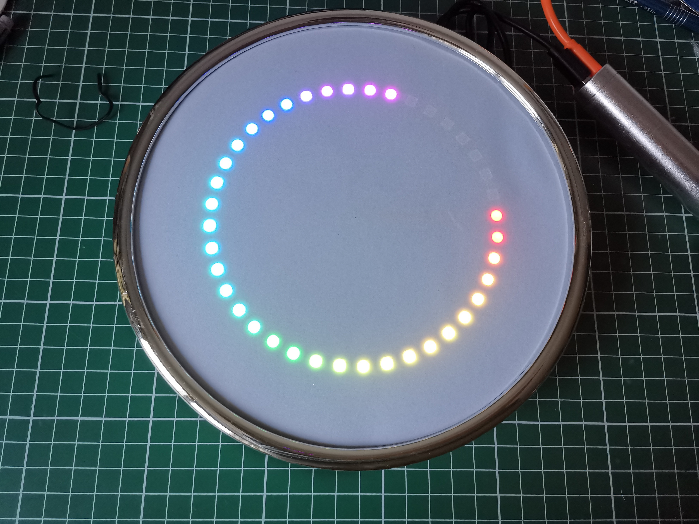

Night light circle clock
==========================

Current status

    In testing phase, still todo:
    - Does the code even work?
    - Battery life?
    - Maybe it's better to count down instead of counting up :think-face:

Purpose: show a toddler the progress of the night from 19:00 to 7:00 in the morning.

During the day we show all colors of the rainbow, from 19:00 till 7:00 in the morning this light
will show a ring of yellow lights.

Meant to make it easy for your toddler to monitor sleep time progress.

Time is collected from the HTTP date response header of [1.1.1.1](https://1.1.1.1/) every week.

Development
--------

Build using [platformio](https://platformio.org/)

    platformio run

Flash your device

    platformio run --target upload

Hardware setup
--------------
- Connect D2 to the data in on the WS2812B led circle ([I bought this one](https://a.aliexpress.com/_U1OLZ))
- Connect 5V to 5V of WS2812B
- Connect GND to ground of WS2812B
- Put everything into a frame, I bought a cheap clock and removed the internals.

Result
------
