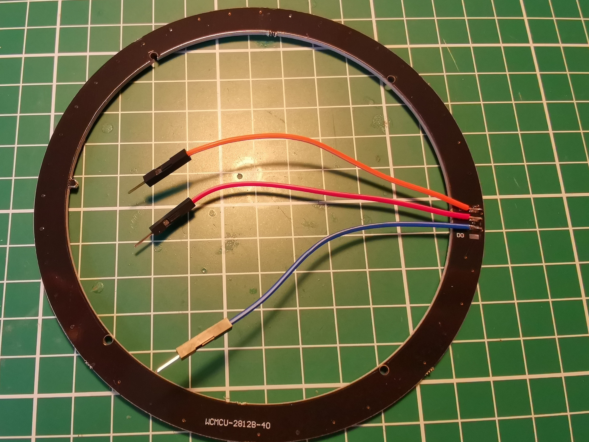

Night light circle clock
==========================

Current status: works, but you need to edit code to make your own.

Purpose: show a toddler the progress of the night from 19:00 to 7:00 in the morning.

During the day we show all colors of the rainbow, from 19:00 till 7:00 in the morning this light
will show a ring of yellow lights.

Meant to make it easy for your toddler to monitor sleep time progress.

Time is collected from the HTTP date response header of [1.1.1.1](https://1.1.1.1/) every week.

Development
--------

Build using [platformio](https://platformio.org/)

    platformio run

Flash your device

    platformio run --target upload

How to make your own
--------------
- Get hardware:
    - [WS2812B led circle](https://a.aliexpress.com/_U1OLZ)
    - Cheap clock or other framing
    - Piece of paper to dimm the lights a bit
    - [Male to female dupont cables](https://www.aliexpress.com/item/32749292647.html)
    - [WEMOS D1 Mini](https://www.aliexpress.com/item/32529101036.html)
- Edit software and flash microcontroller
    - Test run:
        - Install [platformio](https://platformio.org/)
        - Connect the WEMOS D1 mini to your computer
        - In the same folder as `platformio.ini` run the command `platformio run --target upload`
    - Update according to your situation: 
        - Open `src/main.cpp` in a text editor
        - Replace `YOUR_WIFI_NAME` with the name of your Wifi (used to update the time)
        - Replace `YOUR_WIFI_KEY` with the password of your Wifi
        - Change the timezone configuration to your local timezone.
          Just below the lines `// Central European Summer Time` change the code to contain the configuration of your timezone as described in [Coding timechange rules](https://github.com/JChristensen/Timezone#coding-timechangerules)
        - `int previousNightSeconds = (24 - 19) * 3600;` determines the time the 12 hour cicle starts. Currently it's `19:00`. The clock will do 12 hours by filling up with all colors for the day, and 12 hours of yellow for the night.

- Build
    - Cut three dupont cables in half, strip the ends.
    - By soldering the ends, you can easily connect up the microcontroller and LED strip afterwards.
    - Connect D2 to the data in on the WS2812B led circle
    - Connect 5V to 5V of WS2812B
    - Connect GND to ground of WS2812B
    - Put everything into a frame, I bought a cheap clock and removed the internals.

Result
------

If you also made this, or something similair, please consider opening an issue on github to let me know!
